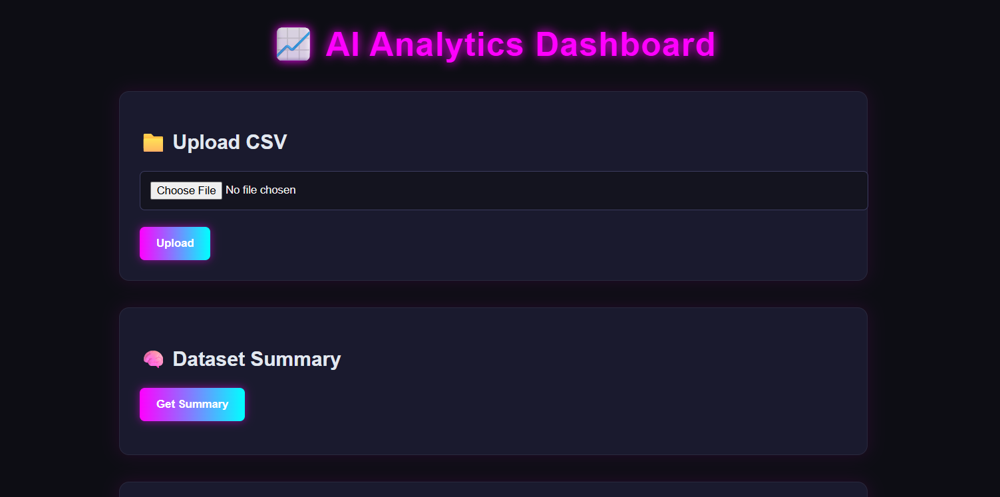
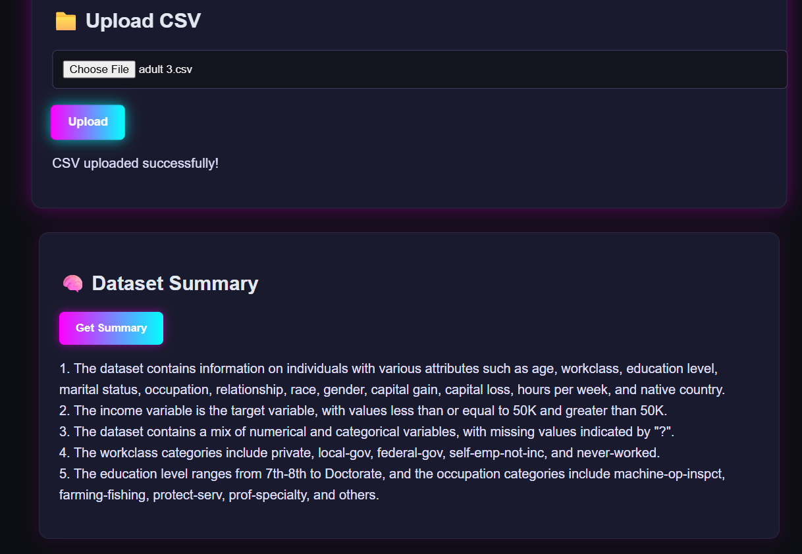
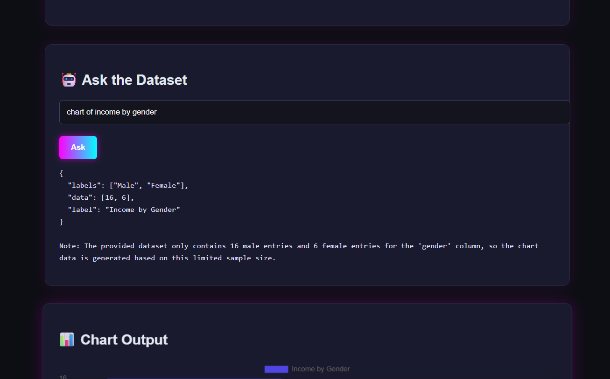
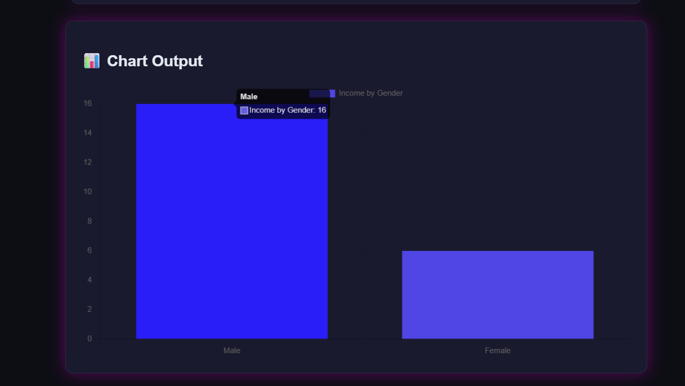

# AI-Powered Analytics Dashboard 🚀

This project is built for the **AdMyBrand "Choose Your Challenge"** task under Task A: *AI-Powered Analytics Dashboard*.

## 🌟 Features

- Upload CSV files and generate smart summaries
- Ask questions to your data using natural language (powered by Mistral AI)
- Modern, responsive UI with a cyberpunk design
- Frontend in **React + Vite**, Backend in **Flask**
- Fully deployed using **Render**

## 🚀 Live Demo

🔗 [Visit the Live App](https://analyze-react.onrender.com)

## 📦 Tech Stack

### Frontend
- React (Vite)
- Axios
- Cyberpunk CSS styling

### Backend
- Python + Flask
- Mistral AI for LLM
- Pandas for data wrangling
- Hosted on Render

## 🧠 AI Usage Report

- **Mistral AI**: Used to interpret natural language questions and generate insights from uploaded CSV data.
- **Prompts**: Optimized prompts for structured question answering and summarization.
- **ChatGPT**: Assisted in building responsive UI components, Flask routes, error handling, and deployment optimization.

## ⚙️ Getting Started (Local Setup)

### Backend

```bash
cd backend
pip install -r requirements.txt
python app.py
```

### Frontend

```bash
cd frontend
npm install
npm run dev
```

> Update the `.env` in frontend with your backend URL:
```
VITE_BACKEND_URL=http://localhost:5000
```

## ✨ Deployment

- Backend: [Render Python Service](https://analyze-c85k.onrender.com)
- Frontend: [Render Static Site](https://analyze-react.onrender.com)

## 🤝 Submission Links

- GitHub Repo: [https://github.com/lasyasb/analyze](https://github.com/lasyasb/analyze)
- Live Site: [https://analyze-react.onrender.com](https://analyze-react.onrender.com)

---
## ScreenShots

### Image 1 – File Upload Interface  


### Image 2 – Summary Generation  


### Image 3 – Chatbot Interaction  
 

### Image 4 – Dashboard View  


---
Made with 💙 by Lasya
